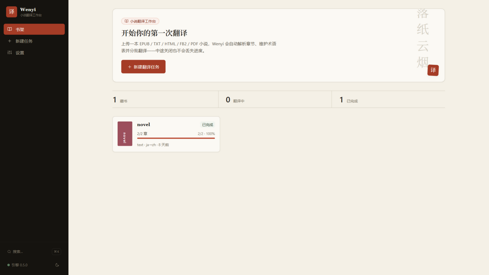
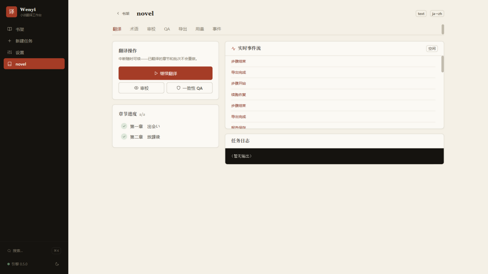
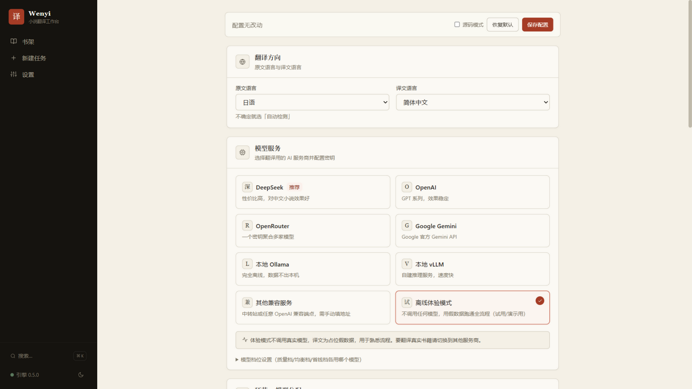

# wenyi

Wenyi（trans-novel）多语言复刻版：Go + Node.js + .NET 10 三组件 + **WebUI 产品主界面**。
行为复刻自 Python 原版 v0.4.1（GitHub: BigDawnGhost/wenyi），验收方式为测试断言迁移（见《测试迁移对照表.md》）。

## 界面预览

书卷纸感设计系统：纸色做底、墨色为字、朱砂点睛；标题衬线、数据等宽，无网络字体依赖，离线可用。



| 书籍详情 · 翻译进度 | 设置 · 模型服务与档位 |
|---|---|
|  |  |

## 运行时前置

- **Go 1.26+**：编译引擎（静态单二进制，无运行时依赖；WebUI 后端同在引擎内）
- **Node.js ≥ 20**：摄取/组装组件（翻译时由引擎自动 spawn）+ WebUI 前端构建
- **.NET 10 Runtime**：仅 PDF 导出功能需要（QuestPDF）

## 快速开始（开发环境）

```bash
# 1. 构建三组件（make build = webui + build-node + build-pdf 一次性全量）
make webui          # WebUI 产物链：构建前端 → 复制进 go:embed 目录 → 重编 dist/wenyi.exe
make build-node     # Node 依赖（摄取/组装组件）
make build-pdf      # .NET PDF 组件 → dist/wenyi-pdf

# 2. WebUI（产品主界面，单 exe，启动自动打开浏览器）
dist/wenyi.exe web                          # 默认 http://127.0.0.1:8731
dist/wenyi.exe web --port 8731 --no-open    # 自定义端口 / 不自动开浏览器

# 3. 无头 CLI（脚本接口）
dist/wenyi.exe translate book.epub        # 断点续跑
dist/wenyi.exe status book.epub
dist/wenyi.exe --help
```

配置：WebUI 读取 exe 同目录 `config.json`（优先）或 `config.yaml`；设置页可管理
API Key 直存、环节 × 模型档位、JSON 源码模式，保存时旧 YAML 自动迁移为
`config.json`（原文件留 `.bak`）。

## 组件结构

```
├── cmd/wenyi/            # Go 引擎入口（编排/智能体/LLM/术语/Review/状态存储 + web 子命令）
├── internal/             # Go：config/llm/providers/agents/glossary/review/pipeline/punct/jsonx/cli
├── internal/webserver/   # WebUI 后端（REST 全端点/双 SSE/JobRegistry/Host 白名单/术语库直连）+ go:embed 内嵌前端
├── node/
│   ├── cli.js            # Node 入口：doc parse|assemble（摄取/组装，由引擎 spawn 调用）
│   ├── src/doc/          # 摄取（EPUB/FB2/HTML/TXT/PDF）+ 组装（EPUB 回填/双语/HTML/TXT/MD）
│   ├── ui/               # WebUI 前端源码（React 19 + TS + Vite + Tailwind）
│   └── ui-dist/          # 前端构建产物（make webui 时复制进 internal/webserver/static 内嵌）
├── pdf/                  # .NET 10 PDF 组件（QuestPDF，A5 + CJK）
├── testdata/             # 语言无关测试夹具
└── dist/                 # 构建产物（wenyi.exe / wenyi-pdf/）
```

## 测试

```bash
make test-go     # Go 全量（212 用例，含 webserver 19 + 配置新字段 4）
make test-node   # Node 全量（78 用例，摄取/组装/PDF/RunAll 集成/冒烟）
make test-pdf    # .NET 冒烟（4 用例）
```

## 文档

- 《测试迁移对照表.md》——18 个 Python 测试文件 → Go/Node 测试的逐项映射
- 《已知差异清单.md》——与 Python 原版的全部行为差异声明
- 《DEVLOG.md》——开发过程日志
